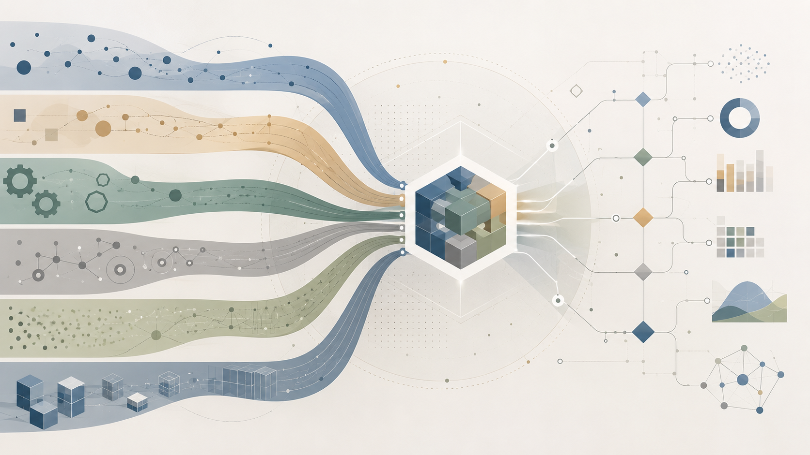

## Software starts with a problem

A software product is primarily an attempt to solve a problem. The problem may exist within an internal business operation or it can be an unsolved need of the people as a whole. Of course, solving one problem can create others and social media is such an example. This is, however, a topic for another article. 

The question is then "What is a problem?" One possible answer is that almost anything can be considered a problem because every operation can be improved indefinitely within the limits of the laws of nature. This is not extremely helpful, though, because we can't solve all problems at once. Then, we can somehow organize problems hierarchically and then attempt to solve them in a way that improves several related sub-problems simultaneously, even if it does not solve them entirely. Assuming this is a good way to approach the situation, then the next question is "Who determines the hierarchy of problems?"

## Domain experts and decisions

The answer must involve a combination of executives, managers and technical leaders. Among them, domain experts should play a primary role. But who are they? In a law firm, the domain experts are the lawyers, or depending on their specialization, there can be subdomain experts (labour law experts for instance). But how about domain experts in larger businesses? Usually things become blurrier there, because the domain itself may lack a clear definition. It usually involves a combination of processes, constraints, user behaviours and expectations. In that environment, someone may be designated a domain expert because of a relevant educational background, experience in a similar position or industry or simply management experience. This designation may be neutral or it can be bad.

It can be neutral when the domain experts have an open mind and are willing to discuss alternative priorities and alternative approaches to solve problems relevant to these priorities, accepting, essentially, that they may not know everything about the domain, especially around its boundaries. Usually, in a larger business there are many moving parts and it’s not uncommon for each operations manager to consider their own problems as the most important ones. Thinking that your own problems are the most important is not by itself bad, it's just human. It can become bad when this thinking forms the basis of a business decision to proceed with one project or another or change a system in certain ways. 

Politics exist in all organizations, it's just inevitable. The question is to what degree they exist. The most successful organizations are those that adopt a holistic approach to evaluating problems and priorities and are not driven primarily by the disproportionate influence of a particular team or manager. 

## Domain expertise is a shared responsibility

Nevertheless, even incomplete domain expertise is preferable to having no domain expertise at all. You can't expect to build any software product without any information about why this product is needed, who the target users are, what business constraints exist, why the previous product or process is no longer satisfactory, how competitors approach a similar problem and many other questions. Partial information is better than no information at all or relying on your own research, which at best will be incomplete. 

Having domain experts is as important as building the product itself. What's the point of being an exceptional software developer but building the wrong product? Lacking domain experts is extremely expensive for a company in the long term. At the same time, developers must be willing to learn things about their industry and business and demand participation in meetings, which will facilitate this learning. It goes the other way around too. Ops managers need to know the basics of how software products work. I've sometimes heard from ops people the phrase "Do your magic, George". There is no magic here and this perception shouldn't exist, and it will stop existing if people have some basic understanding of software systems.  

## Are data science products different?

The answer is no. The difference is that data science involves analysing and using data. Yes, you can use statistical methods to derive some conclusions, but what if the data are misleading? What if you haven't understood the context? What if you don't know how the product will be used? 

In a way, domain experts might be even more important regarding data science products, since these products may automate operational decisions. Optimizing for the wrong objective can have potentially catastrophic consequences. For more than a decade, I have seen job postings requiring data scientists to have domain knowledge or, at least, a willingness to learn about the domain. I suppose this requirement was based on the understanding of how critical it can be to have a sound system producing the wrong output.  

## Can't AI be the ultimate multi-domain expert?

Perhaps it can eventually be, but we're not there yet. AI systems continue to make mistakes. This is partly why domain-specialized RAG-based applications exist, but even they have limitations. Sometimes there is no universally best way to approach a problem. It may depend on the industry, country, city, context and business-specific considerations. There may be a lack of reliable material online to help those systems provide accurate information. It's not uncommon for businesses not to document everything regarding the domain.     

## Conclusion

I tried here to express my thoughts on the issue, not only because of the lessons and frustrations in my career so far, but also because I understand how important domain expertise is while working on a more personal project. Domain expertise is the foundation of a successful software product and, now that everything is about building things fast, we tend to forget that products that last are products with a solid foundation.  
